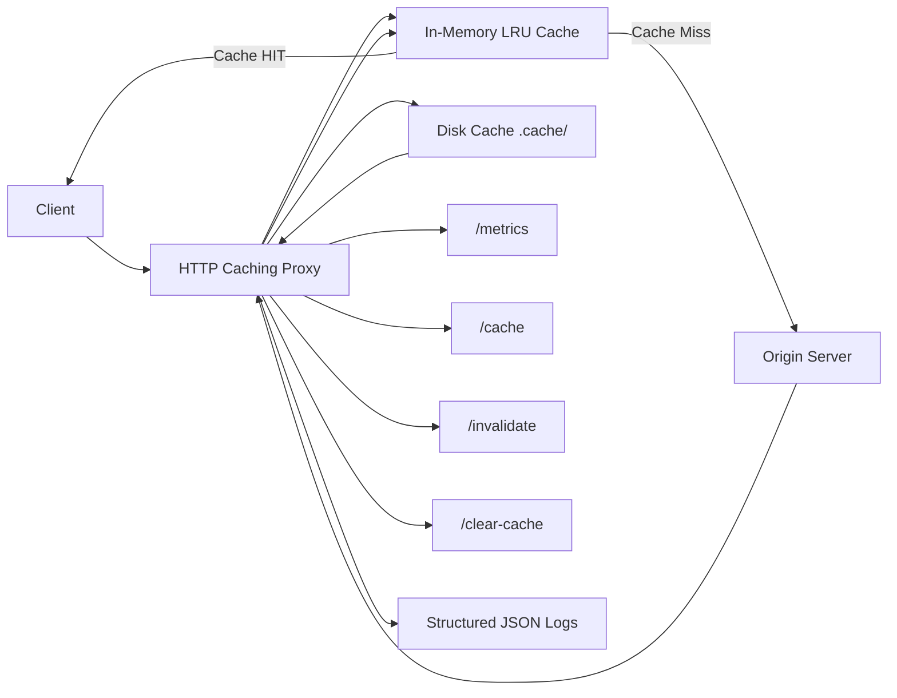
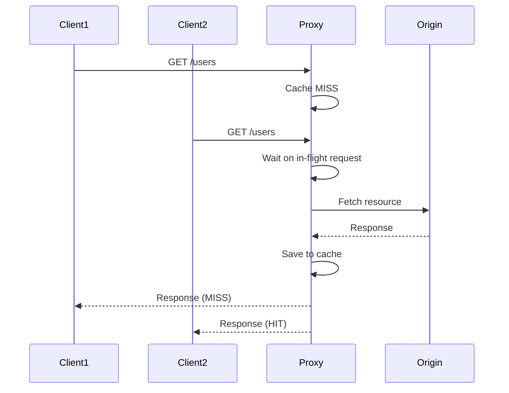

# HTTP Caching Proxy

A Python-based HTTP caching proxy that forwards requests to an origin server while adding caching, persistence, concurrency control, and observability features.

## Features

### Core Proxy

- Forwards HTTP GET requests to an origin server
- Preserves response status codes and headers
- Adds `X-Cache: HIT | MISS` header

### Caching System

- In-memory LRU cache(`OrderedDict`)
- TTL-based expiration
- Configurable cache size
- Cache key format: `METHOD:PATH`

### Persistence

- Disk-based cache using `.cache/` directory
- Survives server restarts
- JSON-based serialization
- Automatic cleanup of expired entries

### Concurrency

- Thread-safe caching using locks
- Request coalescing (prevents duplicate origin calls)
- Built on `ThreadingHTTPServer`

### Performance Optimizations

- Connection pooling via `requests.Session`
- Retry strategy with exponential backoff (urllib3)

### Observability

- Structured JSON logs for :
    - cache hits/misses
    - origin fetches
    - evictions
    - coalesced requests
- Metrics endpoint:
    `GET /metrics`

### Admin Endpoints

- `GET /cache` → view cache state
- `GET /clear-cache` → clear cache
- `GET /invalidate?key=...` → invalidate entry

## How It Works

### Request Flow

1. Request arrives
2. Check in-memory cache
3. If hit → return immediately 
4. If miss:
    - Check request coalescing
    - Fetch from origin if needed
    - Store in memory → disk
5. Return response

### Cache Lifestyle

- Stored in memory (LRU)
- Persisted to disk
- Expired via TTL
- Evicted when full

## Architecture 



### Request Coalescing Flow



## Tech Stack

- Python 3
- `http.server`
- `requests`
- `urllib3`
- threading (Lock, Event)
- Docker

## Docker

### Build

`docker build -t caching-proxy .`

### Run

```bash
docker run -p 8000:8000 \
  -e PORT=8000 \
  -e ORIGIN=https://jsonplaceholder.typicode.com \
  -e TTL=60 \
  caching-proxy \
  python caching_proxy.py --port 8000 --origin $ORIGIN
```

## What this project demonstrates

- HTTP proxy server design
- In-memory and disk-backed caching
- LRU eviction strategies
- TTL-based cache expiration
- Thread-safe shared state management
- Request coalescing under concurrent load
- Connection pooling and retry strategies
- Structured logging and metrics collection
- Cache invalidation workflows
- Dockerized deployment